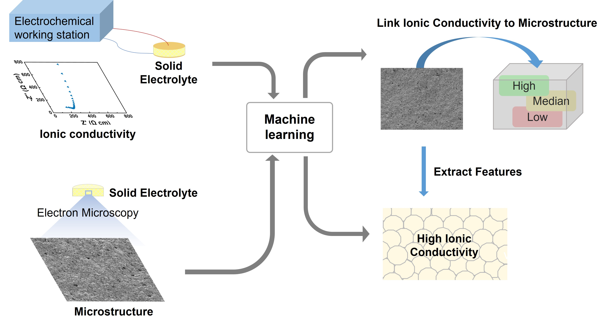

# Machine learning on microstructure-property relationship of lithium-ion conducting oxide solid electrolytes
Official implementation of ['Machine learning on microstructure-property relationship of lithium-ion conducting oxide solid electrolytes'](https://doi.org/10.1021/acs.nanolett.4c00902).

The paper has been accepted by **Nano Letters**.

## Introduction
Here, we develop an algorithmic framework to understand the effect of microstructure on the properties of microstructures by linking the microscopic morphology images to their ionic conductivities. We adopt garnet and perovskite polycrystalline oxides as examples and quantify the microscopic morphologies via extracting determined physical parameters from the images. It directly visualizes the effect of physical parameters on their corresponding ionic conductivities. As a result, we can determine the microstructural features of a Li-ion conductor with high ionic conductivity, which can guide the synthesis of highly conductive solid electrolytes. Our work provides a novel approach to understanding the microstructure−property relationship for solid-state ionic materials, showing the potential to extend to other structural/functional ceramics with various physical properties in other fields.
<div align="center">
  
</div>

## Dataset
All the data used in this paper has been uploaded to folder 'data'. The images are named after the value of the ionic conductivity and are assigned to folders with different levels of conductivity.

## Requirements
Please install [Python](https://www.python.org/downloads/) before running the code.
```bash
# Install the package we need 
pip install torch torchvision torchaudio scikit-learn numpy matplotlib

# You can verify the installation by running the following Python script:
import torch
import sklearn
import numpy as np
import matplotlib.pyplot as plt

print("PyTorch version:", torch.__version__)
print("scikit-learn version:", sklearn.__version__)
print("NumPy version:", np.__version__)
print("Matplotlib version:", plt.__version__)
```

## Acknowledgement
This work benefits from [CAM](https://github.com/jacobgil/pytorch-grad-cam). Thanks for the wonderful works.

## Citation
```bash
@article{doi:10.1021/acs.nanolett.4c00902,
author = {Zhang, Yue and Lin, Xiaoyu and Zhai, Wenbo and Shen, Yanran and Chen, Shaojie and Zhang, Yining and Yu, Yi and He, Xuming and Liu, Wei},
title = {Machine Learning on Microstructure–Property Relationship of Lithium-Ion Conducting Oxide Solid Electrolytes},
journal = {Nano Letters},
volume = {24},
number = {17},
pages = {5292-5300},
year = {2024},
doi = {10.1021/acs.nanolett.4c00902},
note ={PMID: 38648075},
URL = {https://doi.org/10.1021/acs.nanolett.4c00902},
eprint = {https://doi.org/10.1021/acs.nanolett.4c00902}
}
```

## Contact
If you have any question about this project, please feel free to contact linxy1@seas.upenn.edu.
